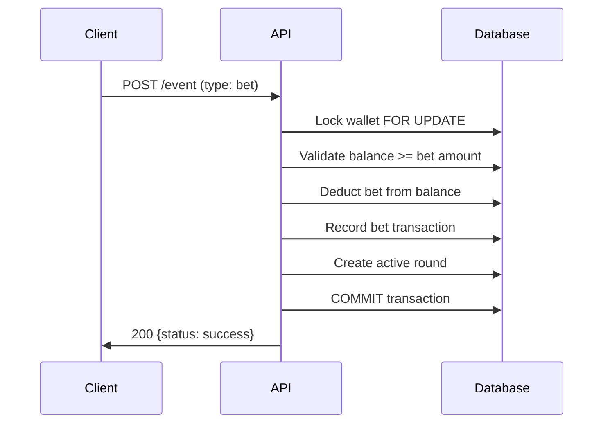
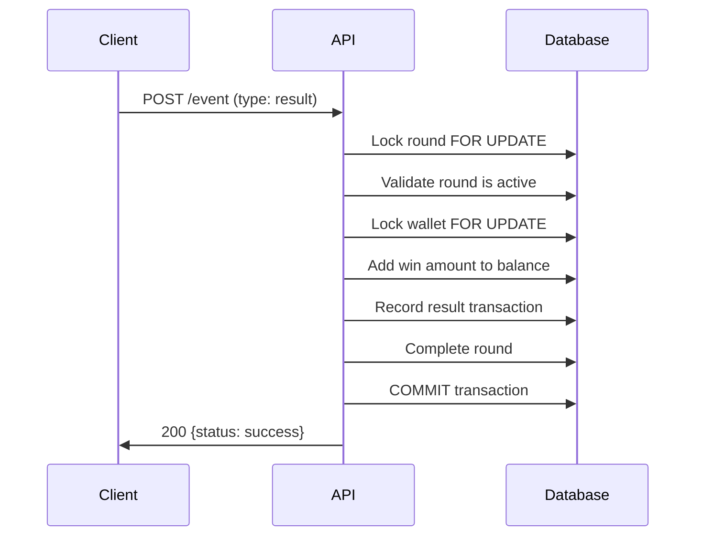

# Casino Wallet API


## 🛠️ Tech Stack

### Backend
- **Runtime**: Node.js (v18+) or Bun
- **Framework**: Express.js v5
- **Language**: JavaScript (ES6+)

### Database & Storage
- **Primary Database**: PostgreSQL (v13+)

### Key Libraries
- **Validation**: Joi v17 - Request validation and sanitization
- **Financial Math**: Decimal.js v10 - Precise decimal arithmetic for money calculations
- **Security**: Helmet v8 - Security headers and protection

### Development & Testing
- **Package Manager**: Bun (primary) or npm


## 🏗️ Architecture

### Database Schema

The system uses PostgreSQL with four main tables:

#### Players Table
```sql
- id (VARCHAR(50), PRIMARY KEY)
- name (VARCHAR(100))
- email (VARCHAR(255))
- created_at, updated_at (TIMESTAMP)
```

#### Wallets Table  
```sql
- id (VARCHAR(50), PRIMARY KEY)
- player_id (VARCHAR(50), FOREIGN KEY)
- balance (DECIMAL(15,2), CHECK >= 0)
- currency (VARCHAR(3), DEFAULT 'INR')
- created_at, updated_at (TIMESTAMP)
```

#### Transactions Table
```sql
- id (SERIAL, PRIMARY KEY)
- req_id (VARCHAR(100), UNIQUE)
- player_id, wallet_id, round_id, session_id
- type ('bet' | 'result')
- amount (DECIMAL(15,2))
- balance_before, balance_after (DECIMAL(15,2))
- status, created_at
```

#### Rounds Table
```sql
- round_id (VARCHAR(100), PRIMARY KEY)
- player_id, session_id, game_code
- bet_req_id, result_req_id
- bet_amount, result_amount (DECIMAL(15,2))
- status ('active' | 'completed')
- created_at, completed_at
```

### Key Design Decisions

1. **Row-Level Locking**: Uses `FOR UPDATE` to prevent race conditions
2. **Database Transactions**: All operations are atomic and consistent
3. **Decimal Precision**: Financial calculations use Decimal.js for accuracy
4. **Request Idempotency**: Unique req_id prevents duplicate processing

## 🚀 How to Run Locally

### Prerequisites

- Node.js (v18+) or Bun runtime
- PostgreSQL (v13+) with createdb permissions
- Git

### Quick Start

1. **Clone the repository**
   ```bash
   git clone https://github.com/KeremMus/casino-wallet-api.git
   cd casino-wallet-api
   ```

2. **Install dependencies**
   ```bash
   bun install
   # or
   npm install
   ```

3. **Environment Setup**
   
   Create a `.env` file in the root directory:
   ```env
   # Database Configuration
   DB_HOST=localhost
   DB_PORT=5432
   DB_NAME=casino_wallet
   DB_USER=<your_username(you current username on macOS actually)>
   DB_PASSWORD=<your_password (I did not arrange a password for quick testing)>
   DB_SSL=false
   
   # Server Configuration
   PORT=3000
   NODE_ENV=development


4. **Create Database**
   ```bash
   # Connect to PostgreSQL and create database
   createdb casino_wallet
   
   # Or using psql
   psql -U your_username -c "CREATE DATABASE casino_wallet;"
   ```

5. **Database Setup**
   ```bash
   # Run database migrations
   bun run setup
   
   # Seed sample data
   bun run seed
   ```

6. **Start the Server**
   ```bash
   # Development mode (with hot reload)
   bun run dev
   
   # Production mode
   bun run start
   ```

The API will be available at `http://localhost:3000`


## 🔄 Betting Flow

### 1. Bet Placement


### 2. Result Processing



## 📋 Design Assumptions & Notes

### Core Assumptions

1. **Single Currency per Wallet**: Each wallet operates in one currency (default: INR)
2. **Request Idempotency**: All requests must include a unique `req_id` (UUID format)
3. **Round-Based Gaming**: Each betting round must have a bet before a result
4. **Atomic Operations**: All wallet operations are atomic - either fully succeed or fully fail
5. **Balance Constraints**: Wallets cannot have negative balances
6. **Player-Wallet Relationship**: One-to-one relationship between players and wallets

### Design Decisions

1. **Row-Level Locking**: Uses PostgreSQL's `FOR UPDATE` to prevent race conditions during concurrent balance updates
2. **Database Transactions**: All betting operations wrapped in database transactions for ACID compliance
3. **Decimal Precision**: Uses Decimal.js library to avoid floating-point precision issues with financial calculations
4. **Request Validation**: Comprehensive input validation using Joi schemas before processing
5. **Error Recovery**: Transaction rollback on any failure ensures data consistency
6. **Audit Trail**: Complete transaction history maintained for compliance and debugging

## 🚀 Potential Improvements

- **Caching Layer**: Redis caching for frequently accessed wallet balances
- **Database Optimization**: Query optimization, read replicas for analytics
- **Connection Pooling**: Fine-tuned connection pool settings for high load


## 🛠️ Available Scripts

```bash
bun run start        # Start production server
bun run dev          # Start development server with hot reload  
bun run test         # Run test suite
bun run test:watch   # Run tests in watch mode
bun run setup        # Run database migrations
bun run seed         # Seed sample data
```

## 🐛 Troubleshooting

### Common Issues

1. **Database Connection Errors**
   - Verify PostgreSQL is running
   - Check environment variables in `.env`
   - Ensure database exists and user has permissions

4. **Rate Limiting Issues**
   - Adjust `RATE_LIMIT_MAX_REQUESTS` in environment
   - Consider implementing user-specific rate limits
   - Monitor request patterns
